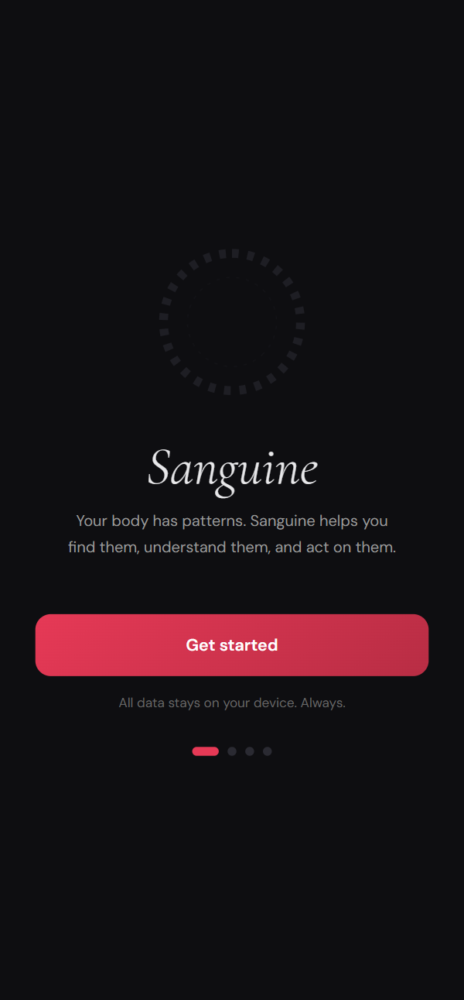
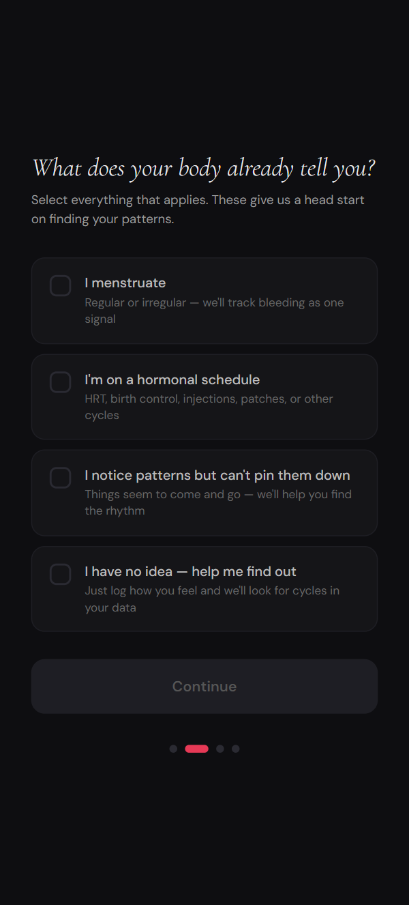
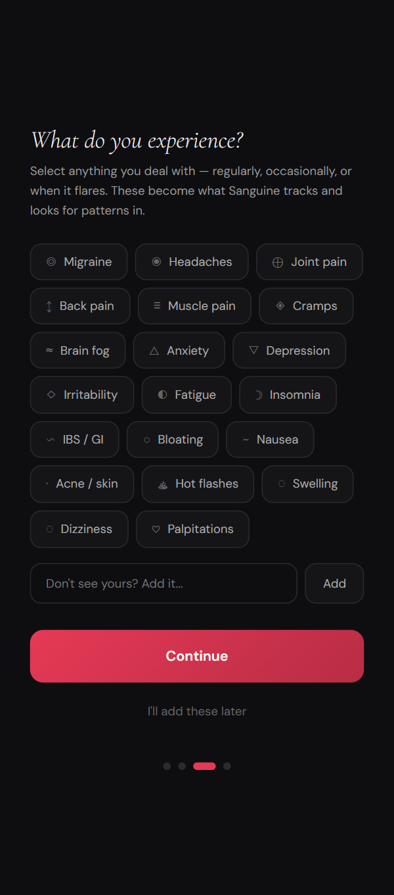
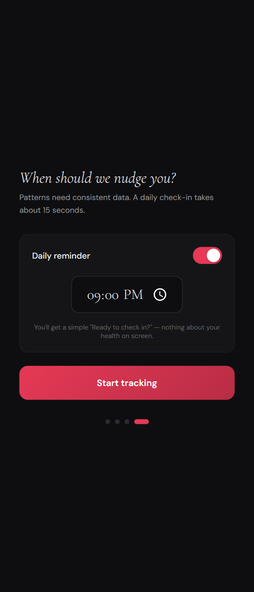
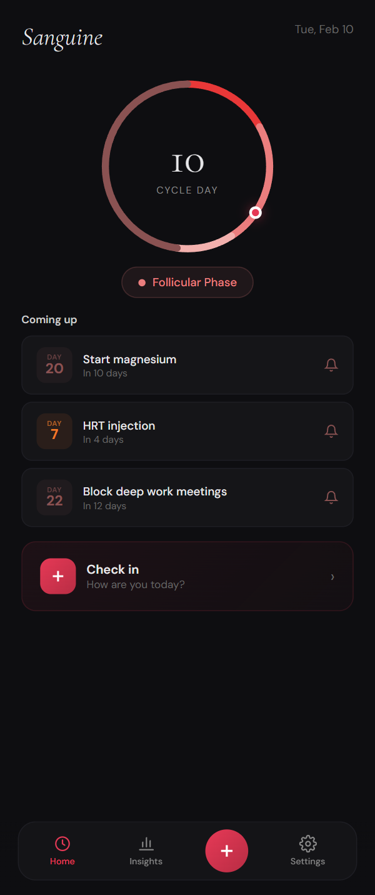
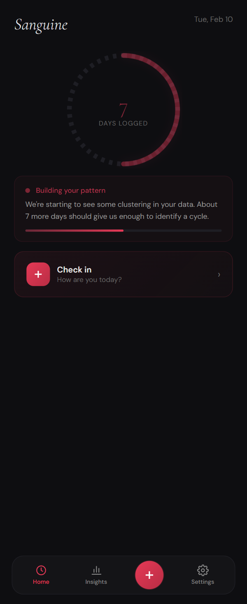
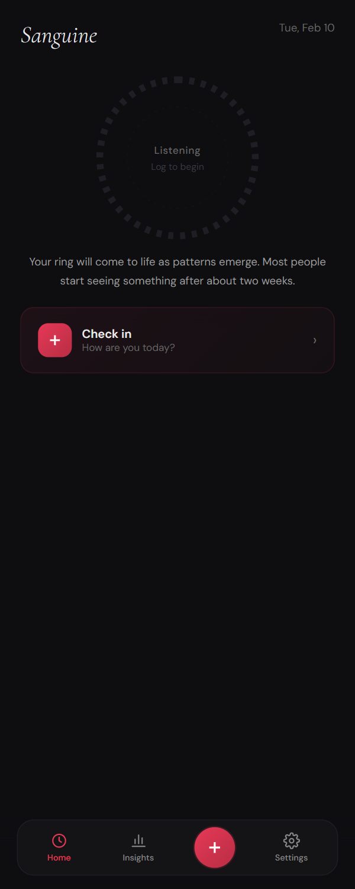
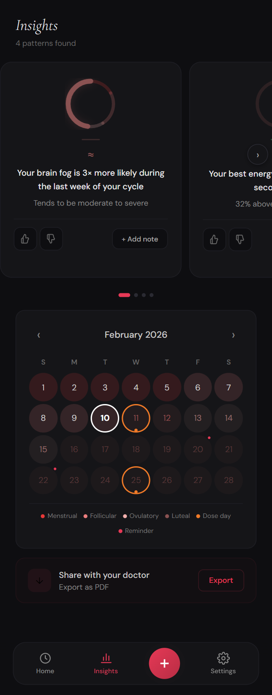
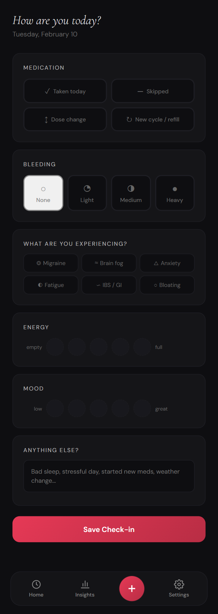

# Sanguine

*Your body has patterns. Sanguine helps you find them.*

A body pattern tracker that looks for cyclical patterns in how you feel over time. You log symptoms and conditions daily, and the app surfaces correlations you can act on, annotate, and share with a doctor.

Cycles are one optional lens. If you menstruate, that's one pattern source. If you're on a medication schedule like HRT or birth control, that's another. If you don't know whether your body has a cycle, the app looks for one in your data. You can track multiple overlapping cycles simultaneously.

Everything runs on your device. There is no server, no account, no data collection of any kind.

## Contents

- [Values](#values)
- [Design](#design)
- [Planned Architecture & Stack](#planned-architecture)
- [Status](#status)
- [License](#license)
- [Wireframes](#wireframes)

---

## Values

These are commitments that govern every design and engineering decision.

**Zero-knowledge privacy.** No server, no account, no database, no analytics, no crash reporting. We cannot access your data because we do not possess it. If a feature would require a server, we won't build it.

**Safety by design.** Stealth mode (alternative icon and name), app lock with optional decoy state, discreet notifications, generic export filenames, encrypted local storage. Available to everyone in settings without requiring self-identification.

**Inclusive by default.** Onboarding lets you select any combination of pattern sources: menstruation, medication schedules, suspected patterns, or full discovery mode.

**Fast input, slow output.** Check-ins are designed to take about 15 seconds. The value comes from what emerges over weeks and months. The app is upfront about this: insights appear when the data supports them.

**Source-available.** Code is publicly readable so privacy claims are verifiable. Not licensed for reuse.

---

## Design

### Visual identity

Dark theme, `#0e0e11` base. Cormorant Garamond (serif, italic) for brand and headings. DM Sans for body and UI. Severity communicated through color: mild `#f0b8c4`, moderate `#d4566a`, severe `#e83838`.

### Colorways

Each tracked cycle gets its own four-shade color family. Overlapping cycles layer visually on the ring and the calendar.

| Name | Primary | Secondary | Tertiary | Muted |
|------|---------|-----------|----------|-------|
| Crimson | `#e83838` | `#eb7e7e` | `#f2b0ad` | `#8a5252` |
| Orange | `#f07a28` | `#f09e5c` | `#f5c08a` | `#8a5a30` |
| Lavender | `#9b7ee6` | `#b8a0e8` | `#d4c4f0` | `#6a5a8a` |
| Magenta | `#d620b0` | `#de62c4` | `#ea9ede` | `#7a3870` |
| Ochre | `#c49a2a` | `#d4b45e` | `#e4d08e` | `#7a6a3a` |

### The ring

The home screen centers on an adaptive ring that represents your cycle. It starts empty (dashed, grey) and fills with color as patterns emerge from logged data. Users with a known cycle see color immediately. Users in discovery mode earn it over time.

---

## Planned Architecture & Stack

Sanguine will not feature user accounts. All information is stored on device, and belongs only to the user.

```
User's device
├── Encrypted local storage (MMKV)
│   ├── Check-in data (conditions, severity, energy, mood, notes)
│   ├── Pattern data (detected cycles and phases)
│   ├── Medication and bleeding data (if applicable)
│   ├── Insight state (feedback, user notes, reminders)
│   └── Preferences and app state
├── Platform-native backup (iCloud Keychain / Google Auto Backup)
└── Manual encrypted export (generic filename, AES-256, user password)
```

React Native + Expo, Expo Router, react-native-mmkv, Zustand, React Native Reanimated + Gesture Handler, react-native-svg, expo-print, expo-notifications (local only). Jest + RNTL, Detox for E2E. EAS Build + EAS Update.

---

## Status

Active design, pre development.

---

## License

Source-available. Code is public for verification, not licensed for reuse. See [LICENSE.md](LICENSE.md).

---

## Wireframes

Rendered from the design prototype.

<p align="center">
  <br>
  <sub>Onboarding · Welcome</sub>
</p>

<p align="center">
  <br>
  <sub>Onboarding · Pattern sources</sub>
</p>

<p align="center">
  <br>
  <sub>Onboarding · Conditions</sub>
</p>

<p align="center">
  <br>
  <sub>Onboarding · Daily reminder</sub>
</p>

<p align="center">
  <br>
  <sub>Home · Established cycle</sub>
</p>

<p align="center">
  <br>
  <sub>Home · Emerging pattern</sub>
</p>

<p align="center">
  <br>
  <sub>Home · Listening (empty)</sub>
</p>

<p align="center">
  <br>
  <sub>Insights · Patterns &amp; calendar</sub>
</p>

<p align="center">
  <br>
  <sub>Check-in</sub>
</p>
